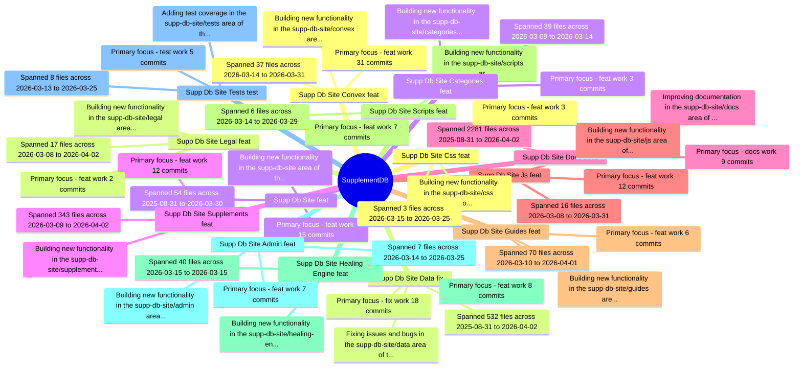
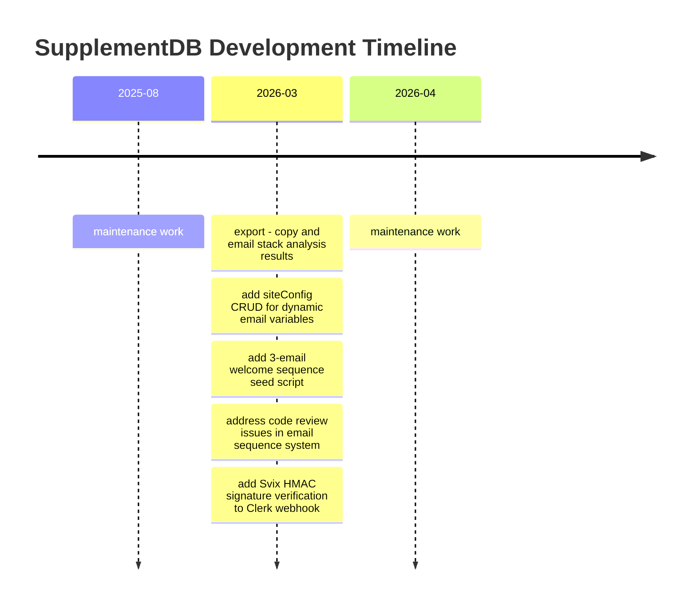

# Project Chronicle: SupplementDB

> Generated: 2026-04-02T18:41:40.065Z

## Project Narrative

SupplementDB evolved through 208 commits across 14 major workstreams from 2025-08-31 to 2026-04-02. The primary areas of development were: Supp Db Site > Convex (feat), Supp Db Site > Data (fix), Supp Db Site (feat), Supp Db Site > Supplements (feat), Supp Db Site > Docs (docs).

The project progressed through distinct phases, with each theme representing a coherent body of work that advanced the overall product. Feature development was the dominant activity, supplemented by bug fixes, documentation improvements, and infrastructure work.

## Theme Map

## Timeline

## Themes

### 1. Supp Db Site > Convex (feat)

**Motivation:** Building new functionality in the supp-db-site/convex area of the codebase.

**Key Decisions:**
- Primary focus: feat work (31 commits)
- Spanned 37 files across 2026-03-14 to 2026-03-31

**Outcome:** Completed 42 commits affecting 37 files.

**Commits:** 42 | **Files:** 37 | **Docs:** BRO-46: Stripe Checkout → PDF Delivery End-to-End QA Implementation Plan, Stack Analyzer Multi-Goal UX Redesign — Implementation Plan, Stack Analyzer: Multi-Goal UX Redesign + Export Features, Email Sequence Admin Panel Implementation Plan, Email Sequence Admin Panel — Design Spec, Admin Dashboard Analytics Enhancement — Design Spec

#### Key Commits

| Date | Message | Files |
|------|---------|-------|
| 2026-03-25 | feat(SUPP-29): add getZeroResultSearches and getSearchTrend queries | 1 |
| 2026-03-25 | feat(SUPP-29): add getSearchConversion action with in-memory session join | 1 |
| 2026-03-25 | feat(SUPP-30): add getActivityFeed and getActivitySummary queries | 1 |
| 2026-03-25 | feat(SUPP-31): add UTM breakdown, new-vs-returning, and bounce rate queries | 1 |
| 2026-03-25 | feat(SUPP-32): add getContentPerformance query | 1 |
| 2026-03-25 | feat(SUPP-32): add fetchScrollDepthByPage PostHog action | 1 |
| 2026-03-25 | feat(SUPP-33): add journeys.ts with drop-off analysis and exit page queries | 1 |
| 2026-03-25 | feat(SUPP-33): add fetchPathAnalysis PostHog action | 1 |
| 2026-03-25 | feat(SUPP-29): add Google Search Console integration with JWT auth | 1 |
| 2026-03-31 | fix: add SUPPLEMENTDB statement descriptor to all Stripe checkout sessions | 1 |

#### Linked Documents

- [BRO-46: Stripe Checkout → PDF Delivery End-to-End QA Implementation Plan](docs\superpowers\plans\2026-03-13-bro-46-stripe-pdf-e2e-qa.md) *(plan)*
- [Stack Analyzer Multi-Goal UX Redesign — Implementation Plan](docs\superpowers\plans\2026-03-16-stack-analyzer-multi-goal-redesign.md) *(plan)*
- [Stack Analyzer: Multi-Goal UX Redesign + Export Features](docs\superpowers\specs\2026-03-16-stack-analyzer-multi-goal-redesign.md) *(spec)*
- [Email Sequence Admin Panel Implementation Plan](supp-db-site\docs\superpowers\plans\2026-03-17-email-sequence-admin-panel.md) *(plan)*
- [Email Sequence Admin Panel — Design Spec](supp-db-site\docs\superpowers\specs\2026-03-17-email-sequence-admin-panel-design.md) *(spec)*
- [Admin Dashboard Analytics Enhancement — Design Spec](supp-db-site\docs\superpowers\specs\2026-03-25-admin-analytics-enhancement-design.md) *(spec)*

### 2. Supp Db Site > Data (fix)

**Motivation:** Fixing issues and bugs in the supp-db-site/data area of the codebase.

**Key Decisions:**
- Primary focus: fix work (18 commits)
- Spanned 532 files across 2025-08-31 to 2026-04-02

**Outcome:** Completed 28 commits affecting 532 files.

**Commits:** 28 | **Files:** 532 | **Docs:** Enhanced Citation Schema Remediation Plan, Citation Validation Tools & Automated Testing, 🛠️ Developer Guide - Evidence-Based Supplement Database, Citation Tracking and Source Documentation, Evidence-Based Supplement Database - Implementation Guide, Comprehensive Test Report: Evidence Bars & Enhanced Citation Modal, Comprehensive Verification Report: Evidence Bar & Enhanced Citation Fixes, Enhanced Citations Integration Validation Report, Enhanced Citations Integration Final Validation Report, Enhanced Citation System Modernization - Implementation Summary, Phase 2A Expansion - Complete Context Management Summary, Enhanced Citations Expansion Plan, Enhanced Citations Progress Log, 📋 Enhanced Citation Expansion Session - August 25, 2025, Enhanced Citation Format Guide, Enhanced Citation System Integration Guide, Gap Analysis: Sleep Evidence Guide & Main Site Integration, Enhanced Citation System - Implementation Roadmap Phase 2, Enhanced Citation System Modernization Guide, Phase 2: Enhanced Citation Expansion - Strategic Categories, 📊 Phase 2: Complete File Categorization, Evidence-Based Supplement Database - Changelog, Phase 2 Enhanced Citation Schema Design, Phase 2 Enhanced Citation System - Pilot Supplements, Project Status Report - Evidence-Based Supplement Database, 📋 Project Summary - Evidence-Based Supplement Database, Enhanced Citation System - Quick Reference Card, Enhanced Citation System Documentation, Smart Citation Renderer Documentation, Citation Data Remediation Implementation Plan

#### Key Commits

| Date | Message | Files |
|------|---------|-------|
| 2026-03-15 | fix(data): verified DOI resolution + clear wrong PMIDs | 15 |
| 2026-03-15 | data(healing): Phase 1 quality flags - reliability scores for all 93 supplements | 93 |
| 2026-03-15 | fix(healing): include pmid_not_found/no_pmid in re-research filter + remediate Bacopa | 2 |
| 2026-03-15 | fix(data): batch remediation - re-researched citations for 53 supplements | 139 |
| 2026-03-19 | fix: reconcile sleep guide to 90 PubMed-verified citations | 3 |
| 2026-03-19 | fix: remove 8 misattributed PMIDs from enhanced_citations source files | 3 |
| 2026-03-19 | fix: remove 221 hallucinated PMIDs from enhanced_citations and regenerate guides | 67 |
| 2026-03-19 | feat: canvas 330 mechanisms into 296 canonical entries with alias map | 2 |
| 2026-03-21 | feat(data): add 20 trending supplements (IDs 94-113) with full pipeline QC | 63 |
| 2026-04-02 | fix: resolve 252 empty citation titles from PubMed across 16 enhanced citation files | 33 |

#### Linked Documents

- [Enhanced Citation Schema Remediation Plan](docs\superpowers\plans\2026-03-15-citation-schema-remediation.md) *(plan)*
- [Citation Validation Tools & Automated Testing](supp-db-site\docs\Citation_Validation_Tools.md) *(doc)*
- [🛠️ Developer Guide - Evidence-Based Supplement Database](supp-db-site\docs\DEVELOPER_GUIDE.md) *(doc)*
- [Citation Tracking and Source Documentation](supp-db-site\docs\development\CITATION_TRACKING.md) *(doc)*
- [Evidence-Based Supplement Database - Implementation Guide](supp-db-site\docs\development\CLAUDE.md) *(doc)*
- [Comprehensive Test Report: Evidence Bars & Enhanced Citation Modal](supp-db-site\docs\development\COMPREHENSIVE_TEST_REPORT.md) *(report)*
- [Comprehensive Verification Report: Evidence Bar & Enhanced Citation Fixes](supp-db-site\docs\development\COMPREHENSIVE_VERIFICATION_REPORT.md) *(report)*
- [Enhanced Citations Integration Validation Report](supp-db-site\docs\development\enhanced-citations-validation-report.md) *(report)*
- [Enhanced Citations Integration Final Validation Report](supp-db-site\docs\development\ENHANCED_CITATIONS_FINAL_VALIDATION_REPORT.md) *(report)*
- [Enhanced Citation System Modernization - Implementation Summary](supp-db-site\docs\development\IMPLEMENTATION_SUMMARY.md) *(doc)*
- [Phase 2A Expansion - Complete Context Management Summary](supp-db-site\docs\development\PHASE-2A-EXPANSION-CONTEXT.md) *(doc)*
- [Enhanced Citations Expansion Plan](supp-db-site\docs\ENHANCED_CITATIONS_EXPANSION_PLAN.md) *(plan)*
- [Enhanced Citations Progress Log](supp-db-site\docs\ENHANCED_CITATIONS_PROGRESS_LOG.md) *(doc)*
- [📋 Enhanced Citation Expansion Session - August 25, 2025](supp-db-site\docs\ENHANCED_CITATION_EXPANSION_SESSION_20250825.md) *(doc)*
- [Enhanced Citation Format Guide](supp-db-site\docs\ENHANCED_CITATION_FORMAT_GUIDE.md) *(doc)*
- [Enhanced Citation System Integration Guide](supp-db-site\docs\Enhanced_Citation_Integration_Guide.md) *(doc)*
- [Gap Analysis: Sleep Evidence Guide & Main Site Integration](supp-db-site\docs\GAP_ANALYSIS_SLEEP_GUIDE.md) *(doc)*
- [Enhanced Citation System - Implementation Roadmap Phase 2](supp-db-site\docs\Implementation_Roadmap_Phase2.md) *(roadmap)*
- [Enhanced Citation System Modernization Guide](supp-db-site\docs\MODERNIZATION_GUIDE.md) *(doc)*
- [Phase 2: Enhanced Citation Expansion - Strategic Categories](supp-db-site\docs\PHASE_2_ENHANCED_CITATION_EXPANSION.md) *(doc)*
- [📊 Phase 2: Complete File Categorization](supp-db-site\docs\PHASE_2_FILE_CATEGORIZATION.md) *(doc)*
- [Evidence-Based Supplement Database - Changelog](supp-db-site\docs\project-management\CHANGELOG.md) *(changelog)*
- [Phase 2 Enhanced Citation Schema Design](supp-db-site\docs\project-management\PHASE_2_CITATION_SCHEMA.md) *(doc)*
- [Phase 2 Enhanced Citation System - Pilot Supplements](supp-db-site\docs\project-management\PHASE_2_PILOT_SUPPLEMENTS.md) *(doc)*
- [Project Status Report - Evidence-Based Supplement Database](supp-db-site\docs\project-management\PROJECT_STATUS.md) *(report)*
- [📋 Project Summary - Evidence-Based Supplement Database](supp-db-site\docs\PROJECT_SUMMARY.md) *(doc)*
- [Enhanced Citation System - Quick Reference Card](supp-db-site\docs\Quick_Reference_Card.md) *(doc)*
- [Enhanced Citation System Documentation](supp-db-site\docs\README.md) *(readme)*
- [Smart Citation Renderer Documentation](supp-db-site\docs\SMART_CITATION_RENDERER_DOCUMENTATION.md) *(doc)*
- [Citation Data Remediation Implementation Plan](supp-db-site\docs\superpowers\plans\2026-03-15-citation-remediation.md) *(plan)*

### 3. Supp Db Site (feat)

**Motivation:** Building new functionality in the supp-db-site area of the codebase.

**Key Decisions:**
- Primary focus: feat work (15 commits)
- Spanned 54 files across 2025-08-31 to 2026-03-30

**Outcome:** Completed 28 commits affecting 54 files.

**Commits:** 28 | **Files:** 54 | **Docs:** BRO-46: Stripe Checkout → PDF Delivery End-to-End QA Implementation Plan, Anti-Scraping Data Moat Implementation Plan, Monograph Preview Wall Implementation Plan, Monograph Preview Wall — Design Spec, 🛠️ Developer Guide - Evidence-Based Supplement Database, Evidence-Based Supplement Database - Implementation Guide, Evidence-Based Supplement Database - Changelog, Development Metrics & Analytics, Project Status Report - Evidence-Based Supplement Database, SupplementDB — Development Roadmap, SupplementDB — Sprint Journal, 📋 Project Summary - Evidence-Based Supplement Database, Admin Analytics Enhancement Implementation Plan, Admin Dashboard Analytics Enhancement — Design Spec

#### Key Commits

| Date | Message | Files |
|------|---------|-------|
| 2026-03-25 | feat: block AI training crawlers in robots.txt | 1 |
| 2026-03-25 | feat: add X-Robots-Tag noai header to all responses | 1 |
| 2026-03-25 | feat: add Vercel Edge Middleware for bot detection | 1 |
| 2026-03-25 | feat: wire obfuscated data into index.html | 1 |
| 2026-03-25 | feat: allow AI search agents (Perplexity, ChatGPT, You) while blocking training crawlers | 2 |
| 2026-03-29 | feat(seo): add Google Search Console verification file | 1 |
| 2026-03-29 | feat(seo): add Google Search Console verification meta tag to homepage | 1 |
| 2026-03-29 | fix(seo): update GSC verification for carlosthomasphotos@gmail.com account | 2 |
| 2026-03-30 | feat(analytics): add Google Analytics 4 (G-TFTNJBCRWH) to homepage | 1 |
| 2026-03-30 | fix(seo): update sitemap.xml domain from supplementdb.co to supplementdb.info | 1 |

#### Linked Documents

- [BRO-46: Stripe Checkout → PDF Delivery End-to-End QA Implementation Plan](docs\superpowers\plans\2026-03-13-bro-46-stripe-pdf-e2e-qa.md) *(plan)*
- [Anti-Scraping Data Moat Implementation Plan](docs\superpowers\plans\2026-03-25-anti-scraping-data-moat.md) *(plan)*
- [Monograph Preview Wall Implementation Plan](docs\superpowers\plans\2026-03-25-monograph-preview-wall.md) *(plan)*
- [Monograph Preview Wall — Design Spec](docs\superpowers\specs\2026-03-25-monograph-preview-wall-design.md) *(spec)*
- [🛠️ Developer Guide - Evidence-Based Supplement Database](supp-db-site\docs\DEVELOPER_GUIDE.md) *(doc)*
- [Evidence-Based Supplement Database - Implementation Guide](supp-db-site\docs\development\CLAUDE.md) *(doc)*
- [Evidence-Based Supplement Database - Changelog](supp-db-site\docs\project-management\CHANGELOG.md) *(changelog)*
- [Development Metrics & Analytics](supp-db-site\docs\project-management\DEVELOPMENT_METRICS.md) *(doc)*
- [Project Status Report - Evidence-Based Supplement Database](supp-db-site\docs\project-management\PROJECT_STATUS.md) *(report)*
- [SupplementDB — Development Roadmap](supp-db-site\docs\project-management\ROADMAP.md) *(roadmap)*
- [SupplementDB — Sprint Journal](supp-db-site\docs\project-management\SPRINT_JOURNAL.md) *(doc)*
- [📋 Project Summary - Evidence-Based Supplement Database](supp-db-site\docs\PROJECT_SUMMARY.md) *(doc)*
- [Admin Analytics Enhancement Implementation Plan](supp-db-site\docs\superpowers\plans\2026-03-25-admin-analytics-enhancement.md) *(plan)*
- [Admin Dashboard Analytics Enhancement — Design Spec](supp-db-site\docs\superpowers\specs\2026-03-25-admin-analytics-enhancement-design.md) *(spec)*

### 4. Supp Db Site > Supplements (feat)

**Motivation:** Building new functionality in the supp-db-site/supplements area of the codebase.

**Key Decisions:**
- Primary focus: feat work (12 commits)
- Spanned 343 files across 2026-03-09 to 2026-04-02

**Outcome:** Completed 21 commits affecting 343 files.

**Commits:** 21 | **Files:** 343 | **Docs:** Stack Analyzer Multi-Goal UX Redesign — Implementation Plan, Stack Analyzer: Multi-Goal UX Redesign + Export Features, Monograph Preview Wall — Design Spec, Enhanced Citations Integration Validation Report, Enhanced Citations Integration Final Validation Report, Enhanced Citations Expansion Plan, Enhanced Citations Progress Log, Gap Analysis: Sleep Evidence Guide & Main Site Integration, Guide Page Redesign Plan: Clinical Journal Dark Theme Migration, Phase 2 Enhanced Citation System - Pilot Supplements, Enhanced Citation System - Quick Reference Card, Sleep Evidence Report — 25-Page PDF, Citation Data Remediation Implementation Plan, Admin Dashboard Analytics Enhancement — Design Spec

#### Key Commits

| Date | Message | Files |
|------|---------|-------|
| 2026-03-21 | fix: restore melatonin design system template and regenerate all 93 monograph pages | 93 |
| 2026-03-25 | fix: regenerate all 113 monograph pages with canonical seed.js design system | 99 |
| 2026-03-25 | feat(seed): insert MONOGRAPH_GATE_POINT marker after section 3 | 114 |
| 2026-03-25 | feat(supplements): regenerate all 113 pages with gate marker + inject gate CSS/JS | 113 |
| 2026-03-29 | fix: QA issues — stale stats, duplicate nav, monograph text duplication | 116 |
| 2026-03-29 | feat(seo): add MedicalWebPage, FAQPage, and BreadcrumbList JSON-LD to all monographs | 114 |
| 2026-03-29 | feat: add sleep guide CTA banner to monographs + fix pricing stats | 116 |
| 2026-03-30 | feat(conversion): add newsletter email capture to all 113 monograph pages | 115 |
| 2026-04-02 | fix: show actual paper titles instead of mechanism names on monograph citations | 114 |
| 2026-04-02 | fix: populate References section from enhanced citations, not just keyCitations | 110 |

#### Linked Documents

- [Stack Analyzer Multi-Goal UX Redesign — Implementation Plan](docs\superpowers\plans\2026-03-16-stack-analyzer-multi-goal-redesign.md) *(plan)*
- [Stack Analyzer: Multi-Goal UX Redesign + Export Features](docs\superpowers\specs\2026-03-16-stack-analyzer-multi-goal-redesign.md) *(spec)*
- [Monograph Preview Wall — Design Spec](docs\superpowers\specs\2026-03-25-monograph-preview-wall-design.md) *(spec)*
- [Enhanced Citations Integration Validation Report](supp-db-site\docs\development\enhanced-citations-validation-report.md) *(report)*
- [Enhanced Citations Integration Final Validation Report](supp-db-site\docs\development\ENHANCED_CITATIONS_FINAL_VALIDATION_REPORT.md) *(report)*
- [Enhanced Citations Expansion Plan](supp-db-site\docs\ENHANCED_CITATIONS_EXPANSION_PLAN.md) *(plan)*
- [Enhanced Citations Progress Log](supp-db-site\docs\ENHANCED_CITATIONS_PROGRESS_LOG.md) *(doc)*
- [Gap Analysis: Sleep Evidence Guide & Main Site Integration](supp-db-site\docs\GAP_ANALYSIS_SLEEP_GUIDE.md) *(doc)*
- [Guide Page Redesign Plan: Clinical Journal Dark Theme Migration](supp-db-site\docs\GUIDE-REDESIGN-PLAN.md) *(plan)*
- [Phase 2 Enhanced Citation System - Pilot Supplements](supp-db-site\docs\project-management\PHASE_2_PILOT_SUPPLEMENTS.md) *(doc)*
- [Enhanced Citation System - Quick Reference Card](supp-db-site\docs\Quick_Reference_Card.md) *(doc)*
- [Sleep Evidence Report — 25-Page PDF](supp-db-site\docs\SLEEP_PDF_INVENTORY_AND_OUTLINE.md) *(report)*
- [Citation Data Remediation Implementation Plan](supp-db-site\docs\superpowers\plans\2026-03-15-citation-remediation.md) *(plan)*
- [Admin Dashboard Analytics Enhancement — Design Spec](supp-db-site\docs\superpowers\specs\2026-03-25-admin-analytics-enhancement-design.md) *(spec)*

### 5. Supp Db Site > Docs (docs)

**Motivation:** Improving documentation in the supp-db-site/docs area of the codebase.

**Key Decisions:**
- Primary focus: docs work (9 commits)
- Spanned 2281 files across 2025-08-31 to 2026-04-02

**Outcome:** Completed 18 commits affecting 2281 files.

**Commits:** 18 | **Files:** 2281 | **Docs:** BRO-46: Stripe Checkout → PDF Delivery End-to-End QA Implementation Plan, Enhanced Citation Schema Remediation Plan, Stack Analyzer Multi-Goal UX Redesign — Implementation Plan, Mechanism Glossary Implementation Plan, Split-Content Paywall Implementation Plan, Anti-Scraping Data Moat Implementation Plan, Monograph Preview Wall Implementation Plan, Mechanism Glossary — Design Spec, Monograph Preview Wall — Design Spec, 🛠️ Developer Guide - Evidence-Based Supplement Database, Evidence-Based Supplement Database - Implementation Guide, Comprehensive Test Report: Evidence Bars & Enhanced Citation Modal, Comprehensive Verification Report: Evidence Bar & Enhanced Citation Fixes, Enhanced Citation System Modernization - Implementation Summary, Phase 2A Expansion - Complete Context Management Summary, 📋 Enhanced Citation Expansion Session - August 25, 2025, Enhanced Citation Format Guide, Enhanced Citation System Integration Guide, Guide Page Redesign Plan: Clinical Journal Dark Theme Migration, Enhanced Citation System - Implementation Roadmap Phase 2, Enhanced Citation System Modernization Guide, Phase 2: Enhanced Citation Expansion - Strategic Categories, 📊 Phase 2: Complete File Categorization, Evidence-Based Supplement Database - Changelog, Phase 2 Enhanced Citation Schema Design, Phase 2 Enhanced Citation System - Pilot Supplements, Project Status Report - Evidence-Based Supplement Database, SupplementDB — Development Roadmap, SupplementDB — Sprint Journal, 📋 Project Summary - Evidence-Based Supplement Database, Enhanced Citation System - Quick Reference Card, Enhanced Citation System Documentation, Citation Data Remediation Implementation Plan, Self-Healing Engine Implementation Plan, Email Sequence Admin Panel Implementation Plan, Admin Analytics Enhancement Implementation Plan, Project Chronicle Implementation Plan, Email Sequence Admin Panel — Design Spec, Admin Dashboard Analytics Enhancement — Design Spec, Project Chronicle — Design Spec, 🧹 Technical Debt Cleanup & Project Organization Plan

#### Key Commits

| Date | Message | Files |
|------|---------|-------|
| 2026-03-17 | docs: add email sequence admin panel design spec + brainstorm artifacts | 16 |
| 2026-03-17 | docs: fix 4 additional spec issues found in second review pass | 1 |
| 2026-03-17 | docs: add email sequence admin panel implementation plan | 1 |
| 2026-03-25 | docs: add admin analytics enhancement design spec | 1 |
| 2026-03-25 | docs: fix spec review issues in analytics enhancement design | 1 |
| 2026-03-25 | docs: add admin analytics enhancement implementation plan | 1 |
| 2026-03-27 | fix: restore __CONVEX_URL__ placeholder in all HTML files | 231 |
| 2026-04-01 | fix: replace all supplementdb.co references with supplementdb.info | 1074 |
| 2026-04-02 | docs: add project-chronicle skill design spec | 1 |
| 2026-04-02 | docs: add project-chronicle implementation plan | 1 |

#### Linked Documents

- [BRO-46: Stripe Checkout → PDF Delivery End-to-End QA Implementation Plan](docs\superpowers\plans\2026-03-13-bro-46-stripe-pdf-e2e-qa.md) *(plan)*
- [Enhanced Citation Schema Remediation Plan](docs\superpowers\plans\2026-03-15-citation-schema-remediation.md) *(plan)*
- [Stack Analyzer Multi-Goal UX Redesign — Implementation Plan](docs\superpowers\plans\2026-03-16-stack-analyzer-multi-goal-redesign.md) *(plan)*
- [Mechanism Glossary Implementation Plan](docs\superpowers\plans\2026-03-19-mechanism-glossary.md) *(plan)*
- [Split-Content Paywall Implementation Plan](docs\superpowers\plans\2026-03-23-split-content-paywall.md) *(plan)*
- [Anti-Scraping Data Moat Implementation Plan](docs\superpowers\plans\2026-03-25-anti-scraping-data-moat.md) *(plan)*
- [Monograph Preview Wall Implementation Plan](docs\superpowers\plans\2026-03-25-monograph-preview-wall.md) *(plan)*
- [Mechanism Glossary — Design Spec](docs\superpowers\specs\2026-03-19-mechanism-glossary-design.md) *(spec)*
- [Monograph Preview Wall — Design Spec](docs\superpowers\specs\2026-03-25-monograph-preview-wall-design.md) *(spec)*
- [🛠️ Developer Guide - Evidence-Based Supplement Database](supp-db-site\docs\DEVELOPER_GUIDE.md) *(doc)*
- [Evidence-Based Supplement Database - Implementation Guide](supp-db-site\docs\development\CLAUDE.md) *(doc)*
- [Comprehensive Test Report: Evidence Bars & Enhanced Citation Modal](supp-db-site\docs\development\COMPREHENSIVE_TEST_REPORT.md) *(report)*
- [Comprehensive Verification Report: Evidence Bar & Enhanced Citation Fixes](supp-db-site\docs\development\COMPREHENSIVE_VERIFICATION_REPORT.md) *(report)*
- [Enhanced Citation System Modernization - Implementation Summary](supp-db-site\docs\development\IMPLEMENTATION_SUMMARY.md) *(doc)*
- [Phase 2A Expansion - Complete Context Management Summary](supp-db-site\docs\development\PHASE-2A-EXPANSION-CONTEXT.md) *(doc)*
- [📋 Enhanced Citation Expansion Session - August 25, 2025](supp-db-site\docs\ENHANCED_CITATION_EXPANSION_SESSION_20250825.md) *(doc)*
- [Enhanced Citation Format Guide](supp-db-site\docs\ENHANCED_CITATION_FORMAT_GUIDE.md) *(doc)*
- [Enhanced Citation System Integration Guide](supp-db-site\docs\Enhanced_Citation_Integration_Guide.md) *(doc)*
- [Guide Page Redesign Plan: Clinical Journal Dark Theme Migration](supp-db-site\docs\GUIDE-REDESIGN-PLAN.md) *(plan)*
- [Enhanced Citation System - Implementation Roadmap Phase 2](supp-db-site\docs\Implementation_Roadmap_Phase2.md) *(roadmap)*
- [Enhanced Citation System Modernization Guide](supp-db-site\docs\MODERNIZATION_GUIDE.md) *(doc)*
- [Phase 2: Enhanced Citation Expansion - Strategic Categories](supp-db-site\docs\PHASE_2_ENHANCED_CITATION_EXPANSION.md) *(doc)*
- [📊 Phase 2: Complete File Categorization](supp-db-site\docs\PHASE_2_FILE_CATEGORIZATION.md) *(doc)*
- [Evidence-Based Supplement Database - Changelog](supp-db-site\docs\project-management\CHANGELOG.md) *(changelog)*
- [Phase 2 Enhanced Citation Schema Design](supp-db-site\docs\project-management\PHASE_2_CITATION_SCHEMA.md) *(doc)*
- [Phase 2 Enhanced Citation System - Pilot Supplements](supp-db-site\docs\project-management\PHASE_2_PILOT_SUPPLEMENTS.md) *(doc)*
- [Project Status Report - Evidence-Based Supplement Database](supp-db-site\docs\project-management\PROJECT_STATUS.md) *(report)*
- [SupplementDB — Development Roadmap](supp-db-site\docs\project-management\ROADMAP.md) *(roadmap)*
- [SupplementDB — Sprint Journal](supp-db-site\docs\project-management\SPRINT_JOURNAL.md) *(doc)*
- [📋 Project Summary - Evidence-Based Supplement Database](supp-db-site\docs\PROJECT_SUMMARY.md) *(doc)*
- [Enhanced Citation System - Quick Reference Card](supp-db-site\docs\Quick_Reference_Card.md) *(doc)*
- [Enhanced Citation System Documentation](supp-db-site\docs\README.md) *(readme)*
- [Citation Data Remediation Implementation Plan](supp-db-site\docs\superpowers\plans\2026-03-15-citation-remediation.md) *(plan)*
- [Self-Healing Engine Implementation Plan](supp-db-site\docs\superpowers\plans\2026-03-15-self-healing-engine.md) *(plan)*
- [Email Sequence Admin Panel Implementation Plan](supp-db-site\docs\superpowers\plans\2026-03-17-email-sequence-admin-panel.md) *(plan)*
- [Admin Analytics Enhancement Implementation Plan](supp-db-site\docs\superpowers\plans\2026-03-25-admin-analytics-enhancement.md) *(plan)*
- [Project Chronicle Implementation Plan](supp-db-site\docs\superpowers\plans\2026-04-02-project-chronicle.md) *(plan)*
- [Email Sequence Admin Panel — Design Spec](supp-db-site\docs\superpowers\specs\2026-03-17-email-sequence-admin-panel-design.md) *(spec)*
- [Admin Dashboard Analytics Enhancement — Design Spec](supp-db-site\docs\superpowers\specs\2026-03-25-admin-analytics-enhancement-design.md) *(spec)*
- [Project Chronicle — Design Spec](supp-db-site\docs\superpowers\specs\2026-04-02-project-chronicle-design.md) *(spec)*
- [🧹 Technical Debt Cleanup & Project Organization Plan](supp-db-site\docs\TECHNICAL_DEBT_CLEANUP_PLAN.md) *(plan)*

### 6. Supp Db Site > Js (feat)

**Motivation:** Building new functionality in the supp-db-site/js area of the codebase.

**Key Decisions:**
- Primary focus: feat work (12 commits)
- Spanned 16 files across 2026-03-08 to 2026-03-31

**Outcome:** Completed 15 commits affecting 16 files.

**Commits:** 15 | **Files:** 16 | **Docs:** Growth Kit - Content Marketing Automation Commands, Stack Analyzer Multi-Goal UX Redesign — Implementation Plan, Split-Content Paywall Implementation Plan, Monograph Preview Wall Implementation Plan, Stack Analyzer: Multi-Goal UX Redesign + Export Features, Split-Content Paywall Design, Monograph Preview Wall — Design Spec, Guide Page Redesign Plan: Clinical Journal Dark Theme Migration, Development Metrics & Analytics, Admin Analytics Enhancement Implementation Plan, Admin Dashboard Analytics Enhancement — Design Spec

#### Key Commits

| Date | Message | Files |
|------|---------|-------|
| 2026-03-16 | feat(ui): tabbed dual-goal results with score donuts, compatibility card, and tab navigation | 1 |
| 2026-03-18 | fix: trim whitespace from env vars to prevent Convex WebSocket failures | 2 |
| 2026-03-23 | feat(rbac): add canAccessSpecificGuide method for guide-level access checks | 1 |
| 2026-03-23 | feat(gate): rewrite content gate for split-content paywall with dual-CTA overlay | 1 |
| 2026-03-25 | feat: add monograph-gate.js for supplement preview wall | 1 |
| 2026-03-25 | feat(SUPP-31): capture UTM params in analytics and pass to Convex | 2 |
| 2026-03-25 | feat: add all new analytics fetcher functions to admin-metrics.js | 1 |
| 2026-03-25 | feat: add admin-analytics-panels.js rendering module and wire up section navigation | 2 |
| 2026-03-27 | fix: prevent infinite refresh loop on monograph pages for signed-in users | 2 |
| 2026-03-31 | fix: add OAuth redirect callback handler for static site login | 1 |

#### Linked Documents

- [Growth Kit - Content Marketing Automation Commands](docs\guides\growth-kit-pr.md) *(doc)*
- [Stack Analyzer Multi-Goal UX Redesign — Implementation Plan](docs\superpowers\plans\2026-03-16-stack-analyzer-multi-goal-redesign.md) *(plan)*
- [Split-Content Paywall Implementation Plan](docs\superpowers\plans\2026-03-23-split-content-paywall.md) *(plan)*
- [Monograph Preview Wall Implementation Plan](docs\superpowers\plans\2026-03-25-monograph-preview-wall.md) *(plan)*
- [Stack Analyzer: Multi-Goal UX Redesign + Export Features](docs\superpowers\specs\2026-03-16-stack-analyzer-multi-goal-redesign.md) *(spec)*
- [Split-Content Paywall Design](docs\superpowers\specs\2026-03-23-split-content-paywall-design.md) *(spec)*
- [Monograph Preview Wall — Design Spec](docs\superpowers\specs\2026-03-25-monograph-preview-wall-design.md) *(spec)*
- [Guide Page Redesign Plan: Clinical Journal Dark Theme Migration](supp-db-site\docs\GUIDE-REDESIGN-PLAN.md) *(plan)*
- [Development Metrics & Analytics](supp-db-site\docs\project-management\DEVELOPMENT_METRICS.md) *(doc)*
- [Admin Analytics Enhancement Implementation Plan](supp-db-site\docs\superpowers\plans\2026-03-25-admin-analytics-enhancement.md) *(plan)*
- [Admin Dashboard Analytics Enhancement — Design Spec](supp-db-site\docs\superpowers\specs\2026-03-25-admin-analytics-enhancement-design.md) *(spec)*

### 7. Supp Db Site > Guides (feat)

**Motivation:** Building new functionality in the supp-db-site/guides area of the codebase.

**Key Decisions:**
- Primary focus: feat work (6 commits)
- Spanned 70 files across 2026-03-10 to 2026-04-01

**Outcome:** Completed 11 commits affecting 70 files.

**Commits:** 11 | **Files:** 70 | **Docs:** Stack Analyzer Multi-Goal UX Redesign — Implementation Plan, Mechanism Glossary Implementation Plan, Stack Analyzer: Multi-Goal UX Redesign + Export Features, Mechanism Glossary — Design Spec, Evidence Guide Reassessment System, 🛠️ Developer Guide - Evidence-Based Supplement Database, Evidence-Based Supplement Database - Implementation Guide, Comprehensive Test Report: Evidence Bars & Enhanced Citation Modal, Comprehensive Verification Report: Evidence Bar & Enhanced Citation Fixes, Parallel Agent Orchestration Plan - Phase 2A Expansion, Phase 2A Expansion - Complete Context Management Summary, Evidence Profile Evaluation Guide, Gap Analysis: Sleep Evidence Guide & Main Site Integration, Phase 2: Enhanced Citation Expansion - Strategic Categories, Sleep Evidence Report — 25-Page PDF

#### Key Commits

| Date | Message | Files |
|------|---------|-------|
| 2026-03-11 | feat: Stack Analyzer MVP — AI-powered supplement stack evaluation tool | 29 |
| 2026-03-19 | fix: reconcile sleep guide citations — 16 → 85 PubMed-verified references | 1 |
| 2026-03-19 | feat: reconcile all 20 evidence guide citations with PubMed-verified data | 20 |
| 2026-03-19 | fix: add clerk-key and convex-url meta tags to all evidence guides | 19 |
| 2026-03-19 | fix: inject citation tab-switching JS into all 19 evidence guides | 19 |
| 2026-03-19 | feat: build mechanism glossary page with search and category navigation | 2 |
| 2026-03-19 | feat: mechanism glossary with 296 descriptions and linked guide pills | 22 |
| 2026-03-23 | feat(sleep): inject soft sign-up nudge banner into free sleep guide | 2 |
| 2026-03-23 | fix: move reveal observer script before split marker so teaser sections render | 21 |
| 2026-04-01 | fix: remove FDA compliance badges and revise methodology page | 49 |

#### Linked Documents

- [Stack Analyzer Multi-Goal UX Redesign — Implementation Plan](docs\superpowers\plans\2026-03-16-stack-analyzer-multi-goal-redesign.md) *(plan)*
- [Mechanism Glossary Implementation Plan](docs\superpowers\plans\2026-03-19-mechanism-glossary.md) *(plan)*
- [Stack Analyzer: Multi-Goal UX Redesign + Export Features](docs\superpowers\specs\2026-03-16-stack-analyzer-multi-goal-redesign.md) *(spec)*
- [Mechanism Glossary — Design Spec](docs\superpowers\specs\2026-03-19-mechanism-glossary-design.md) *(spec)*
- [Evidence Guide Reassessment System](docs\superpowers\specs\2026-03-21-guide-reassessment-system-design.md) *(spec)*
- [🛠️ Developer Guide - Evidence-Based Supplement Database](supp-db-site\docs\DEVELOPER_GUIDE.md) *(doc)*
- [Evidence-Based Supplement Database - Implementation Guide](supp-db-site\docs\development\CLAUDE.md) *(doc)*
- [Comprehensive Test Report: Evidence Bars & Enhanced Citation Modal](supp-db-site\docs\development\COMPREHENSIVE_TEST_REPORT.md) *(report)*
- [Comprehensive Verification Report: Evidence Bar & Enhanced Citation Fixes](supp-db-site\docs\development\COMPREHENSIVE_VERIFICATION_REPORT.md) *(report)*
- [Parallel Agent Orchestration Plan - Phase 2A Expansion](supp-db-site\docs\development\parallel-agent-orchestration-plan.md) *(plan)*
- [Phase 2A Expansion - Complete Context Management Summary](supp-db-site\docs\development\PHASE-2A-EXPANSION-CONTEXT.md) *(doc)*
- [Evidence Profile Evaluation Guide](supp-db-site\docs\EVIDENCE_PROFILE_GUIDE.md) *(doc)*
- [Gap Analysis: Sleep Evidence Guide & Main Site Integration](supp-db-site\docs\GAP_ANALYSIS_SLEEP_GUIDE.md) *(doc)*
- [Phase 2: Enhanced Citation Expansion - Strategic Categories](supp-db-site\docs\PHASE_2_ENHANCED_CITATION_EXPANSION.md) *(doc)*
- [Sleep Evidence Report — 25-Page PDF](supp-db-site\docs\SLEEP_PDF_INVENTORY_AND_OUTLINE.md) *(report)*

### 8. Supp Db Site > Scripts (feat)

**Motivation:** Building new functionality in the supp-db-site/scripts area of the codebase.

**Key Decisions:**
- Primary focus: feat work (7 commits)
- Spanned 6 files across 2026-03-14 to 2026-03-29

**Outcome:** Completed 11 commits affecting 6 files.

**Commits:** 11 | **Files:** 6 | **Docs:** Mechanism Glossary Implementation Plan, Anti-Scraping Data Moat Implementation Plan, Mechanism Glossary — Design Spec, Enhanced Citation Format Guide, Enhanced Citation System Integration Guide, Enhanced Citation System Modernization Guide

#### Key Commits

| Date | Message | Files |
|------|---------|-------|
| 2026-03-19 | fix: add clerk-key and convex-url meta tags to guide generation template | 1 |
| 2026-03-19 | fix: add citation tab JS, CSS, and clerk-key meta to guide generator | 1 |
| 2026-03-19 | feat: link mechanism pills and summary text to glossary in guide generator | 1 |
| 2026-03-21 | feat: add QC validation gate and pipeline reviewer agent | 1 |
| 2026-03-23 | feat(generator): split guide pages into teaser HTML + premium JSON chunks | 1 |
| 2026-03-25 | feat: add build-time honeypot injection for monograph pages | 1 |
| 2026-03-25 | feat: wire anti-scraping pipeline into Vercel build | 1 |
| 2026-03-25 | feat(inject-auth): add supplement page support for monograph gate | 1 |
| 2026-03-25 | fix(inject-auth): add header comment and clarify separate supplement constant | 1 |
| 2026-03-29 | fix: skip Google verification files in Vercel build script | 1 |

#### Linked Documents

- [Mechanism Glossary Implementation Plan](docs\superpowers\plans\2026-03-19-mechanism-glossary.md) *(plan)*
- [Anti-Scraping Data Moat Implementation Plan](docs\superpowers\plans\2026-03-25-anti-scraping-data-moat.md) *(plan)*
- [Mechanism Glossary — Design Spec](docs\superpowers\specs\2026-03-19-mechanism-glossary-design.md) *(spec)*
- [Enhanced Citation Format Guide](supp-db-site\docs\ENHANCED_CITATION_FORMAT_GUIDE.md) *(doc)*
- [Enhanced Citation System Integration Guide](supp-db-site\docs\Enhanced_Citation_Integration_Guide.md) *(doc)*
- [Enhanced Citation System Modernization Guide](supp-db-site\docs\MODERNIZATION_GUIDE.md) *(doc)*

### 9. Supp Db Site > Healing Engine (feat)

**Motivation:** Building new functionality in the supp-db-site/healing-engine area of the codebase.

**Key Decisions:**
- Primary focus: feat work (8 commits)
- Spanned 40 files across 2026-03-15 to 2026-03-15

**Outcome:** Completed 9 commits affecting 40 files.

**Commits:** 9 | **Files:** 40 | **Docs:** Enhanced Citation Schema Remediation Plan, Comprehensive Test Report: Evidence Bars & Enhanced Citation Modal, Comprehensive Verification Report: Evidence Bar & Enhanced Citation Fixes, Enhanced Citation System Modernization - Implementation Summary, 📋 Enhanced Citation Expansion Session - August 25, 2025, Enhanced Citation Format Guide, Enhanced Citation System Integration Guide, Enhanced Citation System - Implementation Roadmap Phase 2, Enhanced Citation System Modernization Guide, Phase 2: Enhanced Citation Expansion - Strategic Categories, Phase 2 Enhanced Citation Schema Design, Phase 2 Enhanced Citation System - Pilot Supplements, Enhanced Citation System - Quick Reference Card, Enhanced Citation System Documentation, Self-Healing Engine Implementation Plan

#### Key Commits

| Date | Message | Files |
|------|---------|-------|
| 2026-03-15 | feat(healing): add Claude-orchestrated self-healing engine | 31 |
| 2026-03-15 | fix(healing): align site-checker slug logic with canonical slugify | 1 |
| 2026-03-15 | feat(healing): add PubMed esearch API for claim-based citation lookup | 3 |
| 2026-03-15 | feat(healing): add writeEnhancedFile for round-trip enhanced citation editing | 2 |
| 2026-03-15 | feat(healing): Phase 1 - flag evidence quality with PubMed cross-validation | 2 |
| 2026-03-15 | feat(healing): Phase 2 - PubMed-driven re-research engine for claim-based citation lookup | 2 |
| 2026-03-15 | feat(healing): Phase 3 - replacement verifier with relevance threshold and archival | 2 |
| 2026-03-15 | feat(healing): Phase 4 - page regeneration orchestrator with visual diff | 2 |
| 2026-03-15 | feat(healing): end-to-end remediation orchestrator with 4-phase pipeline | 2 |

#### Linked Documents

- [Enhanced Citation Schema Remediation Plan](docs\superpowers\plans\2026-03-15-citation-schema-remediation.md) *(plan)*
- [Comprehensive Test Report: Evidence Bars & Enhanced Citation Modal](supp-db-site\docs\development\COMPREHENSIVE_TEST_REPORT.md) *(report)*
- [Comprehensive Verification Report: Evidence Bar & Enhanced Citation Fixes](supp-db-site\docs\development\COMPREHENSIVE_VERIFICATION_REPORT.md) *(report)*
- [Enhanced Citation System Modernization - Implementation Summary](supp-db-site\docs\development\IMPLEMENTATION_SUMMARY.md) *(doc)*
- [📋 Enhanced Citation Expansion Session - August 25, 2025](supp-db-site\docs\ENHANCED_CITATION_EXPANSION_SESSION_20250825.md) *(doc)*
- [Enhanced Citation Format Guide](supp-db-site\docs\ENHANCED_CITATION_FORMAT_GUIDE.md) *(doc)*
- [Enhanced Citation System Integration Guide](supp-db-site\docs\Enhanced_Citation_Integration_Guide.md) *(doc)*
- [Enhanced Citation System - Implementation Roadmap Phase 2](supp-db-site\docs\Implementation_Roadmap_Phase2.md) *(roadmap)*
- [Enhanced Citation System Modernization Guide](supp-db-site\docs\MODERNIZATION_GUIDE.md) *(doc)*
- [Phase 2: Enhanced Citation Expansion - Strategic Categories](supp-db-site\docs\PHASE_2_ENHANCED_CITATION_EXPANSION.md) *(doc)*
- [Phase 2 Enhanced Citation Schema Design](supp-db-site\docs\project-management\PHASE_2_CITATION_SCHEMA.md) *(doc)*
- [Phase 2 Enhanced Citation System - Pilot Supplements](supp-db-site\docs\project-management\PHASE_2_PILOT_SUPPLEMENTS.md) *(doc)*
- [Enhanced Citation System - Quick Reference Card](supp-db-site\docs\Quick_Reference_Card.md) *(doc)*
- [Enhanced Citation System Documentation](supp-db-site\docs\README.md) *(readme)*
- [Self-Healing Engine Implementation Plan](supp-db-site\docs\superpowers\plans\2026-03-15-self-healing-engine.md) *(plan)*

### 10. Supp Db Site > Admin (feat)

**Motivation:** Building new functionality in the supp-db-site/admin area of the codebase.

**Key Decisions:**
- Primary focus: feat work (7 commits)
- Spanned 7 files across 2026-03-14 to 2026-03-25

**Outcome:** Completed 7 commits affecting 7 files.

**Commits:** 7 | **Files:** 7 | **Docs:** Stack Analyzer Multi-Goal UX Redesign — Implementation Plan, Stack Analyzer: Multi-Goal UX Redesign + Export Features, Email Sequence Admin Panel Implementation Plan, Admin Analytics Enhancement Implementation Plan, Email Sequence Admin Panel — Design Spec, Admin Dashboard Analytics Enhancement — Design Spec

#### Key Commits

| Date | Message | Files |
|------|---------|-------|
| 2026-03-14 | feat(admin): add Configuration & Services panel with env var health + Stack Analyzer usage | 4 |
| 2026-03-14 | feat(admin): replace dollar cost metrics with WAT (Weighted API Token) profitability metric | 4 |
| 2026-03-14 | feat(admin): config resolution paths + health check false-positive fix | 4 |
| 2026-03-17 | feat(admin): add Email Sequences admin panel (Tasks 13-15) | 3 |
| 2026-03-17 | feat: add analytics view and manual enrollment modal to email admin | 1 |
| 2026-03-25 | feat: add Search Intelligence, Traffic, Content Performance, Journeys sections and upgrade Activity Log | 1 |
| 2026-03-25 | feat: add admin-analytics.css styles for new dashboard panels | 1 |

#### Linked Documents

- [Stack Analyzer Multi-Goal UX Redesign — Implementation Plan](docs\superpowers\plans\2026-03-16-stack-analyzer-multi-goal-redesign.md) *(plan)*
- [Stack Analyzer: Multi-Goal UX Redesign + Export Features](docs\superpowers\specs\2026-03-16-stack-analyzer-multi-goal-redesign.md) *(spec)*
- [Email Sequence Admin Panel Implementation Plan](supp-db-site\docs\superpowers\plans\2026-03-17-email-sequence-admin-panel.md) *(plan)*
- [Admin Analytics Enhancement Implementation Plan](supp-db-site\docs\superpowers\plans\2026-03-25-admin-analytics-enhancement.md) *(plan)*
- [Email Sequence Admin Panel — Design Spec](supp-db-site\docs\superpowers\specs\2026-03-17-email-sequence-admin-panel-design.md) *(spec)*
- [Admin Dashboard Analytics Enhancement — Design Spec](supp-db-site\docs\superpowers\specs\2026-03-25-admin-analytics-enhancement-design.md) *(spec)*

### 11. Supp Db Site > Tests (test)

**Motivation:** Adding test coverage in the supp-db-site/tests area of the codebase.

**Key Decisions:**
- Primary focus: test work (5 commits)
- Spanned 8 files across 2026-03-13 to 2026-03-25

**Outcome:** Completed 7 commits affecting 8 files.

**Commits:** 7 | **Files:** 8 | **Docs:** Monograph Preview Wall Implementation Plan, Monograph Preview Wall — Design Spec, Comprehensive Test Report: Evidence Bars & Enhanced Citation Modal, Citation Data Remediation Implementation Plan

#### Key Commits

| Date | Message | Files |
|------|---------|-------|
| 2026-03-13 | test(bro-46): add direct API tests for pdf-generator service | 1 |
| 2026-03-13 | test(bro-46): add guide-success UI state tests | 3 |
| 2026-03-13 | test(bro-46): add stripe webhook idempotency test | 1 |
| 2026-03-13 | test(bro-46): add mobile checkout flow tests @mobile | 1 |
| 2026-03-15 | fix(test): update rhodiola test for post-remediation data | 1 |
| 2026-03-25 | test: add Playwright E2E tests for monograph preview wall | 1 |
| 2026-03-25 | fix(tests): use playwright/test import to match project convention | 1 |

#### Linked Documents

- [Monograph Preview Wall Implementation Plan](docs\superpowers\plans\2026-03-25-monograph-preview-wall.md) *(plan)*
- [Monograph Preview Wall — Design Spec](docs\superpowers\specs\2026-03-25-monograph-preview-wall-design.md) *(spec)*
- [Comprehensive Test Report: Evidence Bars & Enhanced Citation Modal](supp-db-site\docs\development\COMPREHENSIVE_TEST_REPORT.md) *(report)*
- [Citation Data Remediation Implementation Plan](supp-db-site\docs\superpowers\plans\2026-03-15-citation-remediation.md) *(plan)*

### 12. Supp Db Site > Css (feat)

**Motivation:** Building new functionality in the supp-db-site/css area of the codebase.

**Key Decisions:**
- Primary focus: feat work (3 commits)
- Spanned 3 files across 2026-03-15 to 2026-03-25

**Outcome:** Completed 5 commits affecting 3 files.

**Commits:** 5 | **Files:** 3 | **Docs:** Stack Analyzer Multi-Goal UX Redesign — Implementation Plan, Split-Content Paywall Implementation Plan, Monograph Preview Wall Implementation Plan, Stack Analyzer: Multi-Goal UX Redesign + Export Features, Split-Content Paywall Design, Monograph Preview Wall — Design Spec

#### Key Commits

| Date | Message | Files |
|------|---------|-------|
| 2026-03-15 | fix(stack-analyzer): resolve CSS/JS class name mismatches breaking UI | 2 |
| 2026-03-16 | feat(css): styles for smart sort, relevance groups, tabs, export, toast, email modal | 1 |
| 2026-03-16 | fix(css): add missing CSS rules for JS-generated class names | 1 |
| 2026-03-23 | feat(css): add dual-CTA, loading skeleton, and error state styles for split-content gate | 1 |
| 2026-03-25 | feat(css): add gate pill and subtitle styles for monograph preview wall | 1 |

#### Linked Documents

- [Stack Analyzer Multi-Goal UX Redesign — Implementation Plan](docs\superpowers\plans\2026-03-16-stack-analyzer-multi-goal-redesign.md) *(plan)*
- [Split-Content Paywall Implementation Plan](docs\superpowers\plans\2026-03-23-split-content-paywall.md) *(plan)*
- [Monograph Preview Wall Implementation Plan](docs\superpowers\plans\2026-03-25-monograph-preview-wall.md) *(plan)*
- [Stack Analyzer: Multi-Goal UX Redesign + Export Features](docs\superpowers\specs\2026-03-16-stack-analyzer-multi-goal-redesign.md) *(spec)*
- [Split-Content Paywall Design](docs\superpowers\specs\2026-03-23-split-content-paywall-design.md) *(spec)*
- [Monograph Preview Wall — Design Spec](docs\superpowers\specs\2026-03-25-monograph-preview-wall-design.md) *(spec)*

### 13. Supp Db Site > Legal (feat)

**Motivation:** Building new functionality in the supp-db-site/legal area of the codebase.

**Key Decisions:**
- Primary focus: feat work (2 commits)
- Spanned 17 files across 2026-03-08 to 2026-04-02

**Outcome:** Completed 3 commits affecting 17 files.

**Commits:** 3 | **Files:** 17 | **Docs:** SupplementDB — Development Roadmap, SupplementDB — Sprint Journal

#### Key Commits

| Date | Message | Files |
|------|---------|-------|
| 2026-03-08 | feat: add complete legal compliance suite — 6 pages + shared stylesheet | 8 |
| 2026-03-09 | feat: Phase 1 — Foundation & Discoverability (SEO, E-E-A-T, structured data) | 14 |
| 2026-04-02 | fix: update all email addresses from supplementdb.com to supplementdb.info | 10 |

#### Linked Documents

- [SupplementDB — Development Roadmap](supp-db-site\docs\project-management\ROADMAP.md) *(roadmap)*
- [SupplementDB — Sprint Journal](supp-db-site\docs\project-management\SPRINT_JOURNAL.md) *(doc)*

### 14. Supp Db Site > Categories (feat)

**Motivation:** Building new functionality in the supp-db-site/categories area of the codebase.

**Key Decisions:**
- Primary focus: feat work (3 commits)
- Spanned 39 files across 2026-03-09 to 2026-03-14

**Outcome:** Completed 3 commits affecting 39 files.

**Commits:** 3 | **Files:** 39 | **Docs:** Growth Kit - Content Marketing Automation Commands

#### Key Commits

| Date | Message | Files |
|------|---------|-------|
| 2026-03-09 | feat: Phase 2 — Content Authority & Growth (category pages, guides, comparisons) | 23 |
| 2026-03-09 | feat: FDA compliance audit + Research Methodology page with trust infrastructure (P1+P2) | 26 |
| 2026-03-14 | feat(pipeline): complete category/stats coverage + single source of truth | 16 |

#### Linked Documents

- [Growth Kit - Content Marketing Automation Commands](docs\guides\growth-kit-pr.md) *(doc)*
